[TOC]


## 伪类
没有‘儿子’的为空标签;
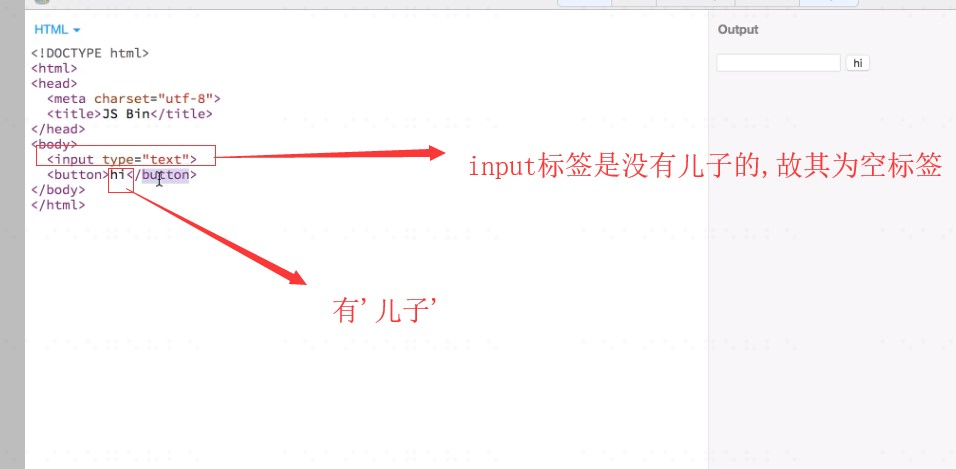
所有非空标签都有伪类;

默认情况下div都有一个before和after，只不过是隐藏的;

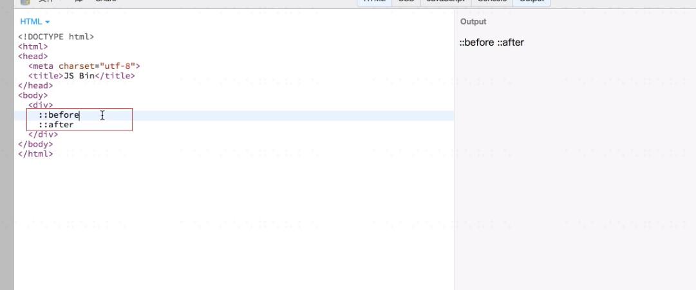

现在div只有一个HI,现在想把伪类给弄出来;
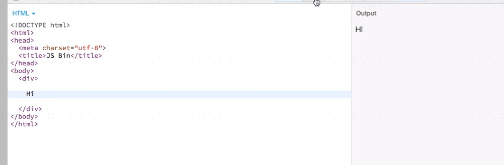

css里面的：
```
div::before{
  content:''
}
```
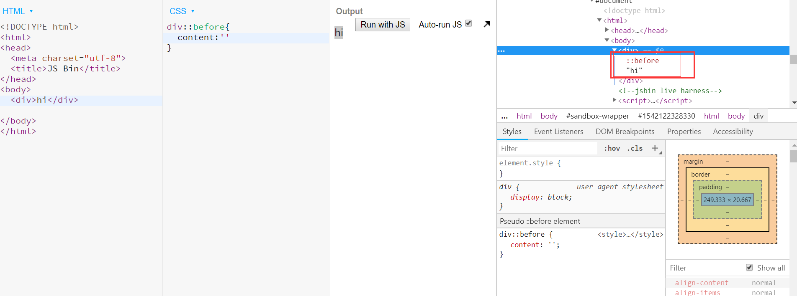

不加css

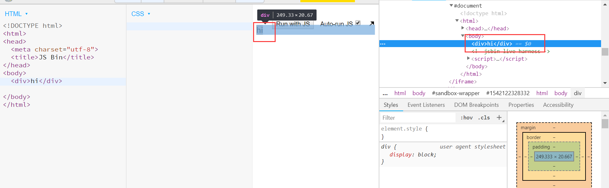

只要写一个div，他就会默认出现一个before是一个正引号,after是一个反引号;

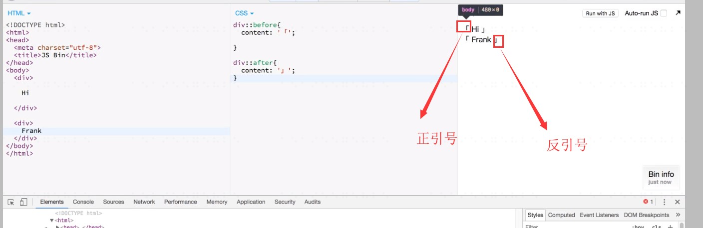

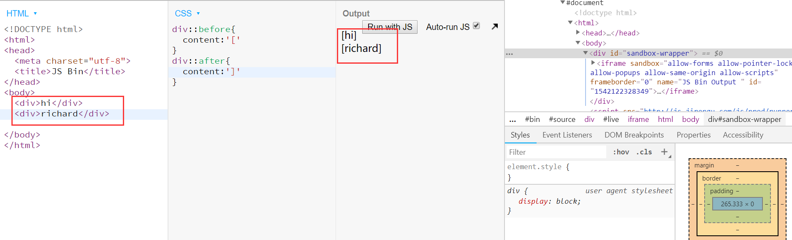


旁边的符号始终选不上;只能选择中间的文字,所以叫伪类;

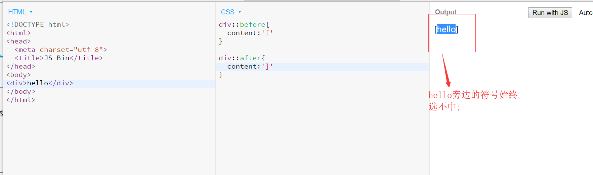
```
div::before{
  content:'[';
  display: block;
  border: 1px solid red;
}

div::after{
  content:']';
  border:1px solid green;
}
```
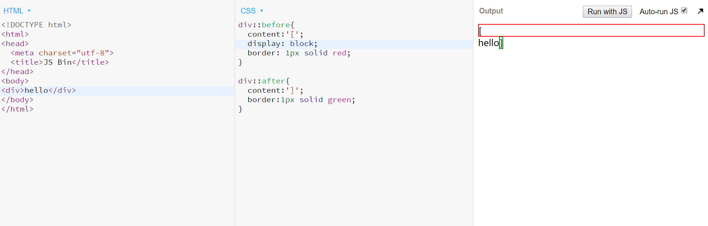


## 线性渐变

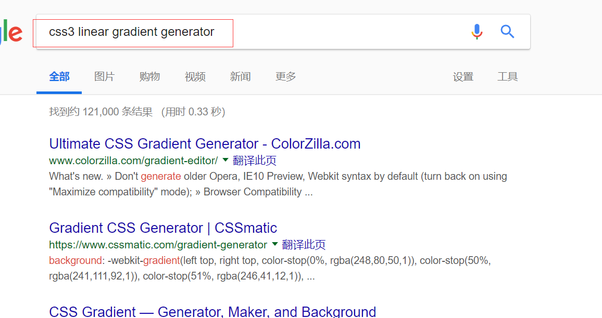

第一个网址;
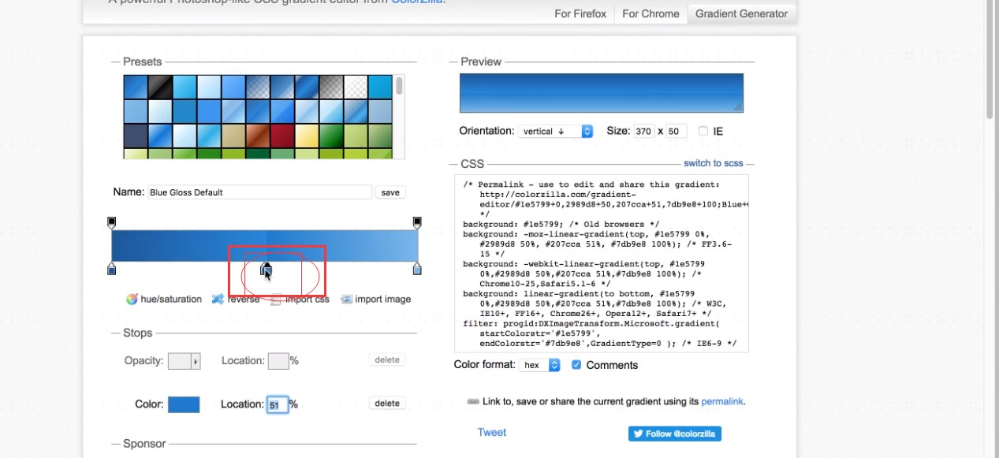
把圈的东西拖掉;


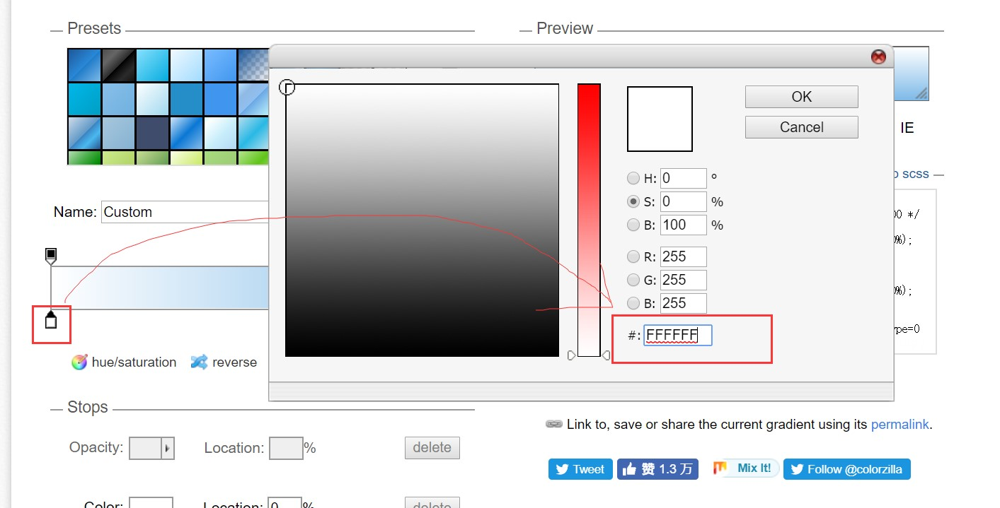
双击这里,改成FFFFFF,白色;

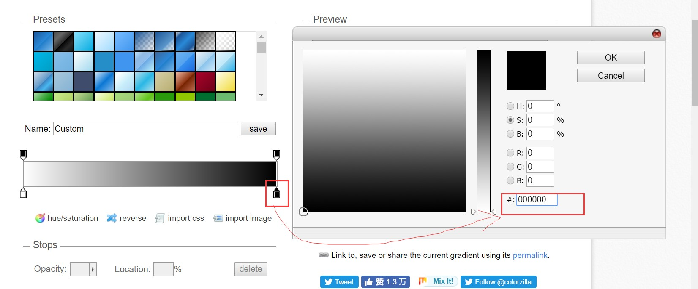
双击右边,改成000000,黑色;

随便点击一个位置,而后改成50%即可;
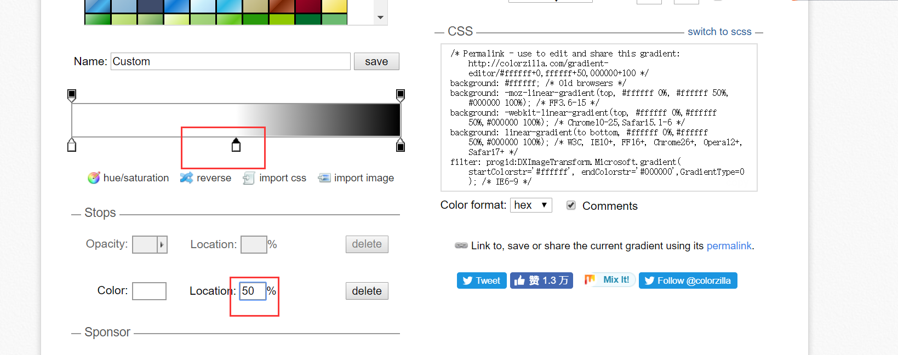
中间也变成白色;

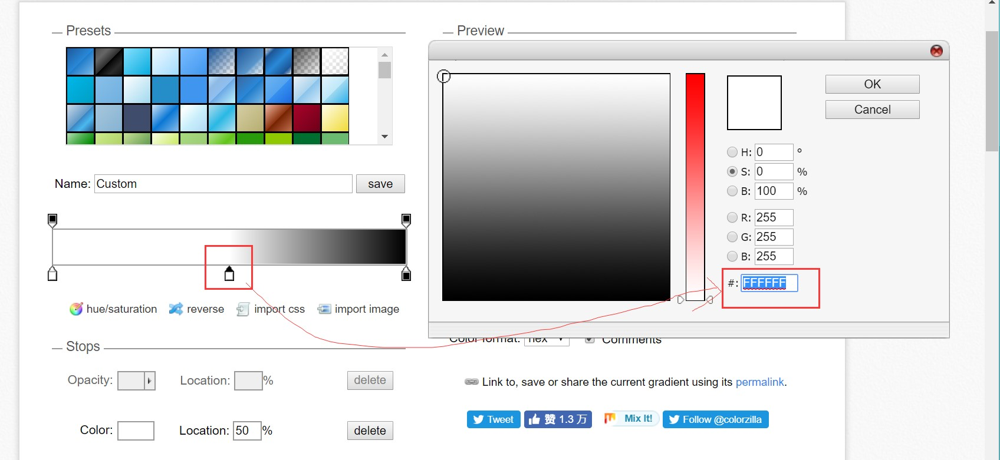

再次点击生成一个条子,设置为51%;设置为黑色(000000);

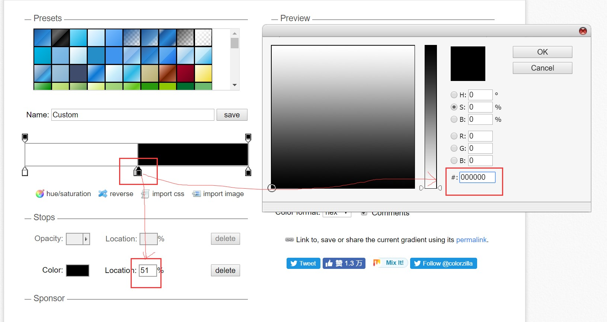


复制这里代码:

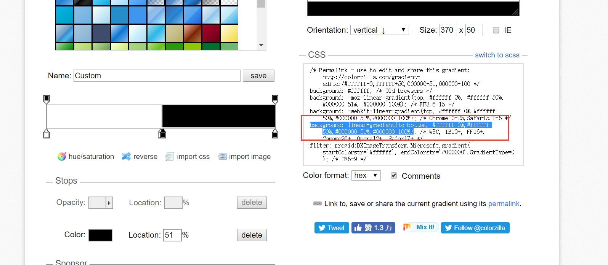

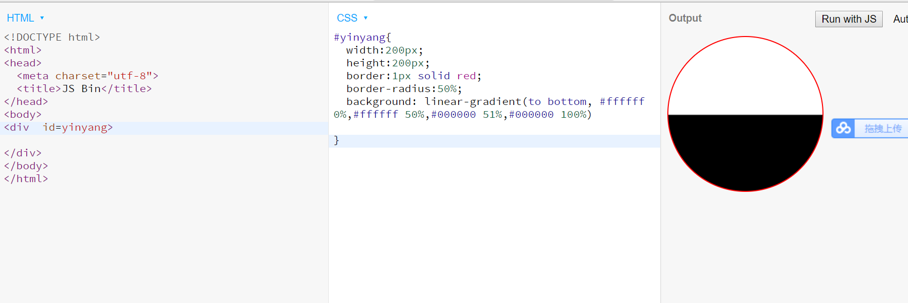

如何生成圆球:
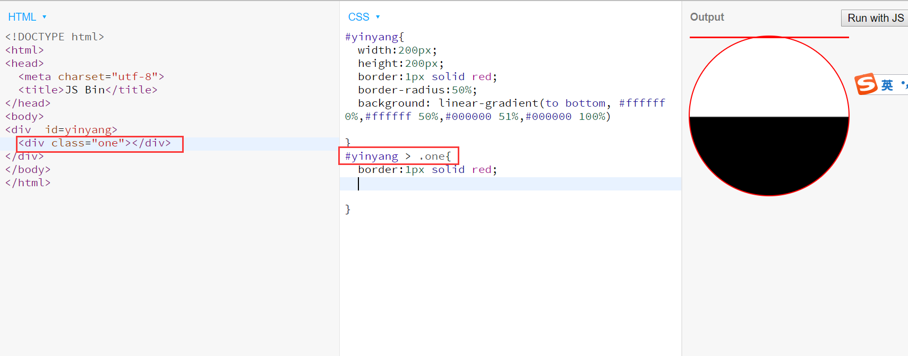

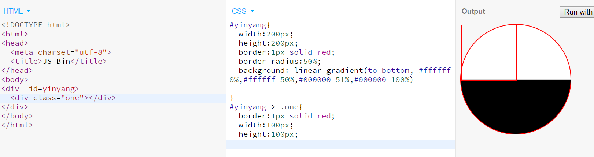
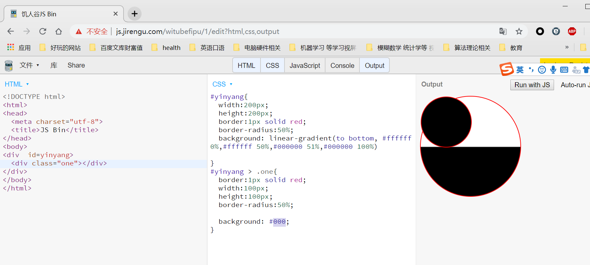


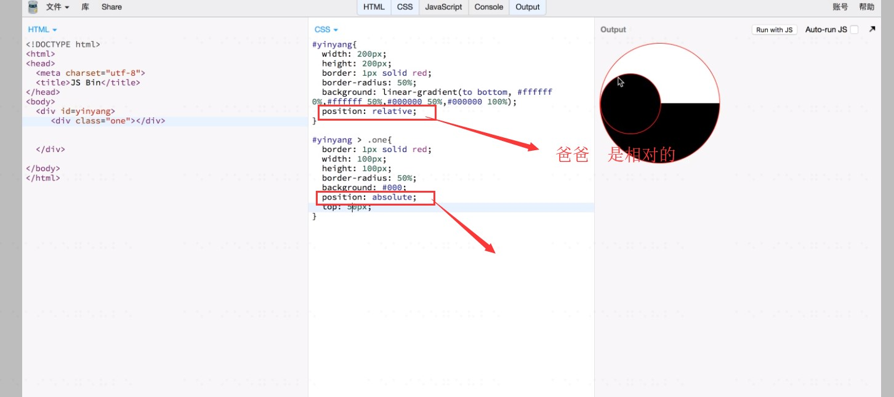
儿子是绝对的;
top可以慢慢调;直至50px;
再把儿子的红色边框去掉;


给了一个东西before，必须要给content；

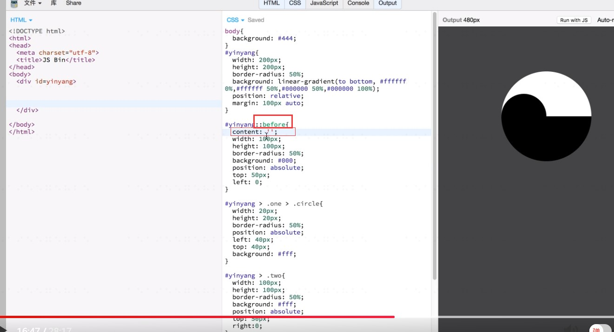
