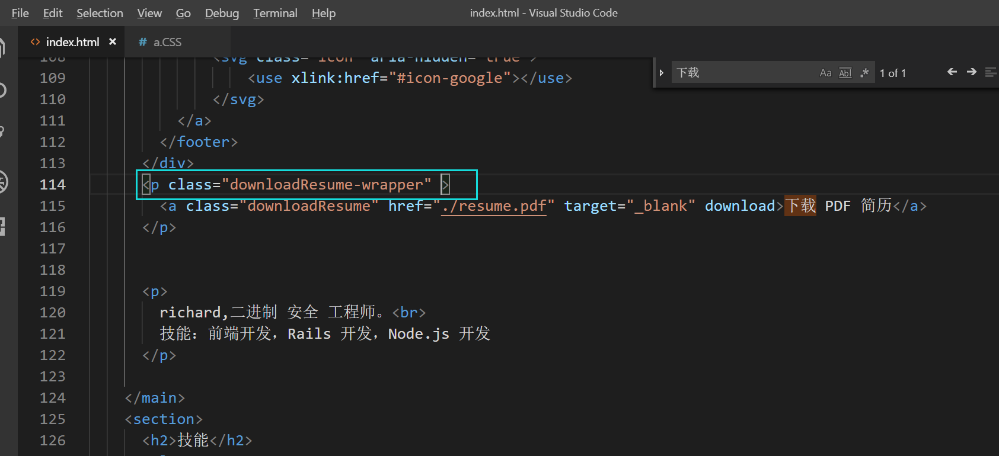
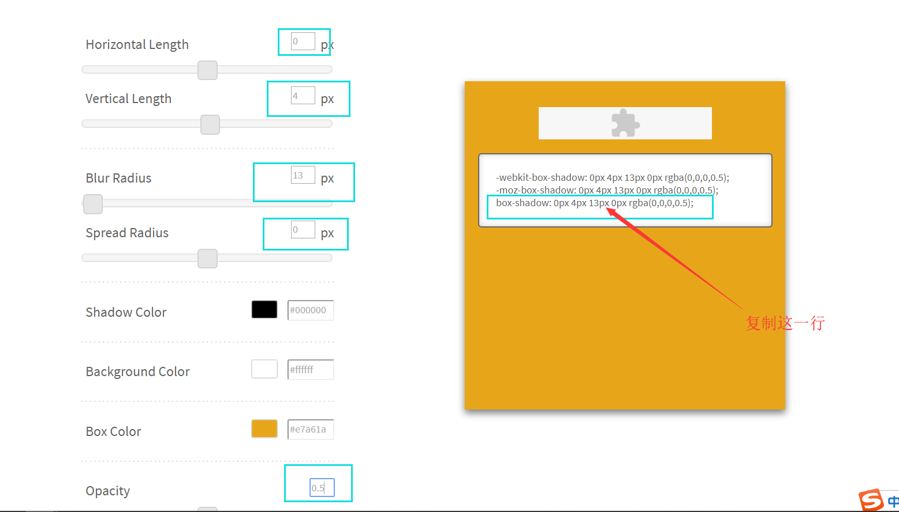

[TOC]

让整个main元素往上退;
最后距离定格在-340px;

## 按钮

这里添加了一个pdf:

写个a标签指向它即可;
现将刚才的那个重构一下:

可以下载了;

### 样式-居中
功能做好了即可加样式了;

注意:内联元素的左右padding有用,上下没有用的;所以还是需要改！

观察其上下并没有撑起来;
注意:内联元素从左 往右流动,如果遇到宽度不够,从左往右继续流;如果是块级元素,每个块占一行,所有的块从上往下依次往下流;

内联元素要居中,需要在它的父级元素上面价格东西;

不要把所有div都写一个宽度,用一个div把他们包起来；这样不太好;
每个div都是自己的div;这样比较好；

重新写一下:

### 边框圆角和背景

### 字体颜色和加粗

### 间距
32px左右；

### 鼠标悬浮阴影效果

### 过渡效果

### 给usercard加阴影

###设置字体

