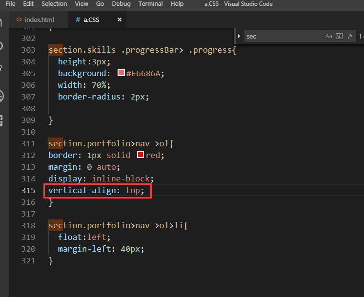

[TOC]

## 不同的技能条长度


## 作品集样式


`section.skills`和`section.portfolio`是一样的样式,这里是这样表示的;


## 让作品集下面的三个字横起来


## 怎样让字居中
1.


2.加了一个`display: inline-block;`


会有两个bug:1.字的下面会有空隙;




```
display: inline-block;
vertical-align: top;
```
以上这两个是搭配在一起的;


设置居中:


又有一个bug:(文字不居中)


## 做白条


出现了一个bug：bar太长了:
目前ol的宽度不确定,ol宽度由它里面的元素确定;里面的元素是由字的个数决定的;
而bar是和谁一样宽,默认是和nav一样宽;有什么办法让nav往内缩呢,nav默认和他爸爸一样宽,即和section 一样宽;
让nav变成display:inline-block;


效果:


bar的宽度由nav决定,nav是由ol宽度决定的;
ol宽度是由里面的字决定的;
div它是一个block元素;block元素会另起一行;
利用的就是文档流block会另起一行;
nav元素首先它不是由div决定的,div比较窄;
上下元素那个元素宽,那么这个nav就和谁一样宽;


中线只用于做结构：
表示bar里面的Inner;不用与做内联；


分开两者:


## 点击效果
这里用js即可；

先要让红的出现:


宽度可以通过下面的width来控制;


## 利用状态机？？

### 先人工


### 如何产生动态

分别点击就会 产生效果:


鼠标点击效果:


过渡：


存放图片的地方:


修改图片:
先用着三个图做绝对定位：


这里会显示其高度为0；
绝对定位的元素是不在文档流里面的;
文档流里面如果 没有东西;那么这个div就不知道有多高了;


给高度:


下面最好用top,left定位,因为后面用js方便计算;
发现需要调一调：


发现在645的时候差不多:

如下图:按着“向下的那个箭头或者向上的那个箭头”即可


再次调试距离:


目前只是做了静态的，响应式的暂时没有做;后面学js的时候再做;
