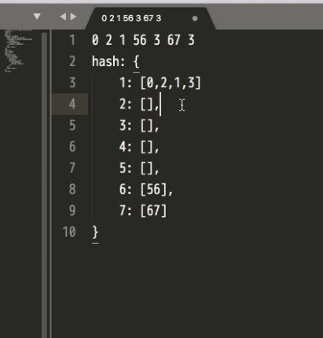
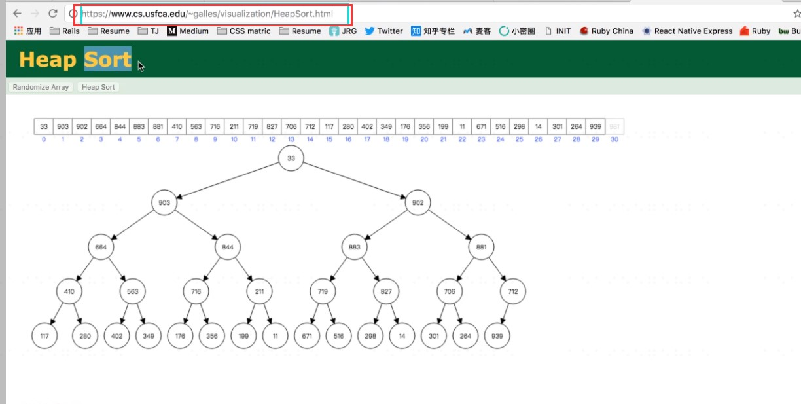

[TOC]

## 定义
每个桶可以放一定范围的数字；
桶的个数是固定的;

## 队列和栈
队列：先进先出;
栈：先进后出;

## 链表和树
https://xiedaimala.com/tasks/3ea29f3b-a84b-4b21-9f16-45ab59311dfd/video_tutorials/af379f4f-848f-4052-ada4-02eacacd65ba

## 堆排序

堆排序的可视化网站;
