[TOC]
https://github.com/clancysong/xdml-notes/blob/master/advanced/44-Session&LocalStorage&Cache-Control.md
https://github.com/wojiaofengzhongzhuifeng/myBlog/issues/40

https://segmentfault.com/a/1190000016692936

## Cookie 理解
进公园
背景: 这个公园有一个总公园, 总公园里有许多小公园(总公园是登录页面, 小公园是域名相同的页面)
第一次进总公园, (第一次请求某个服务器)
工作人员检查你的入园是否符合条件(后端查看是否是注册以后的用户)通过条件的话工作人员会给你一张票(后端会给你一个响应头, 这个响应头的作用是设置一个 cookie )票的内容是只有工作人员才知道是否可以入园的字符串
第二次进总公园(第二次请求相同的域名)
你要带上这个票进公园(浏览器会在请求头带上cookie)工作人员看到这个票, 确认里面的内容正确就给你进去(后端看到这个cookie就会让你直接进入登录后的页面)

## Cookie 的实现(重点)
服务器通过 Set-Cookie 头给客户端一串字符串(背)
客户端每次访问相同域名的网页时，必须带上这段字符串(背)
客户端要在一段时间内保存这个Cookie(背)
Cookie 默认在用户关闭页面后就失效，后台代码可以任意设置 Cookie 的过期时间
[大小在4kb以内](https://stackoverflow.com/questions/640938/what-is-the-maximum-size-of-a-web-browsers-cookies-key)
### cookie存在的问题:
用户可以随意篡改 Cookie

## Session的实现
将 SessionID（随机数）通过 Cookie 发给客户端
客户端访问服务器时，服务器读取 SessionID
服务器有一块内存（哈希表）保存了所有 session
通过 SessionID 我们可以得到对应用户的隐私信息，如 id、email
这块内存（哈希表）就是服务器上的所有 session
## Localstorage与Session的比较
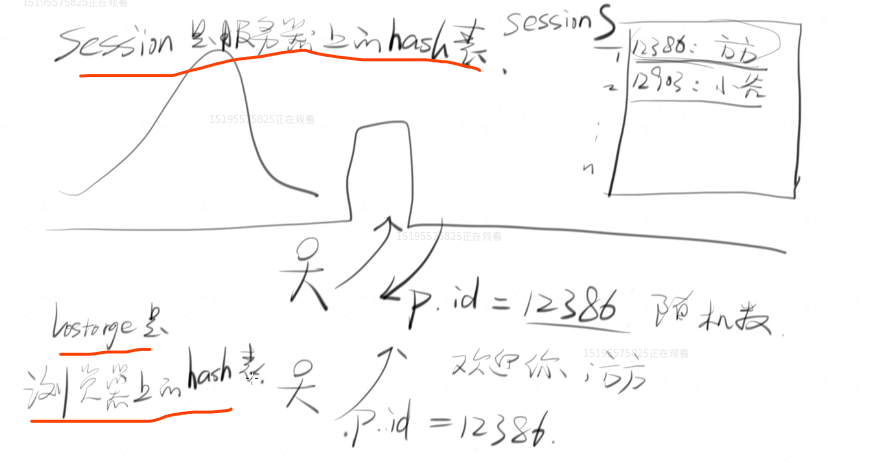
session是服务器上面的hash(表)
localstorage是浏览器上面的hash表
session就是耗内存,cookies不耗用内存;
每次登陆的时候session_id是是不一样的!但是session_id所对应的value是不变的!(其实就是相当于给value加密了,每次加完密之后的session_id是不一样的，但是value是一样的)
## localstorage
总共三个api:
setItem,getItem,clear;

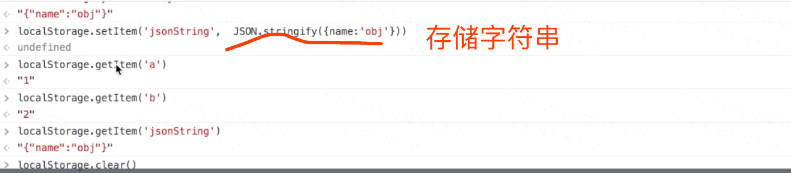
localstorage实现了持久化存储:
在有localStorage之前,所有的变量,在页面刷新的那一刻,都消失了!全部被销毁;

有了localstorage之后,你可以把一些东西存到本地的C盘文件(用于以后使用);

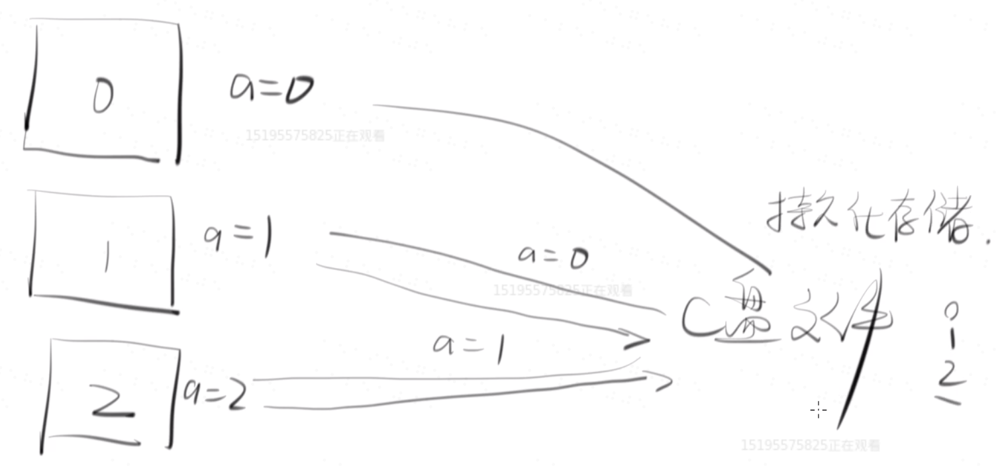

举个例子:
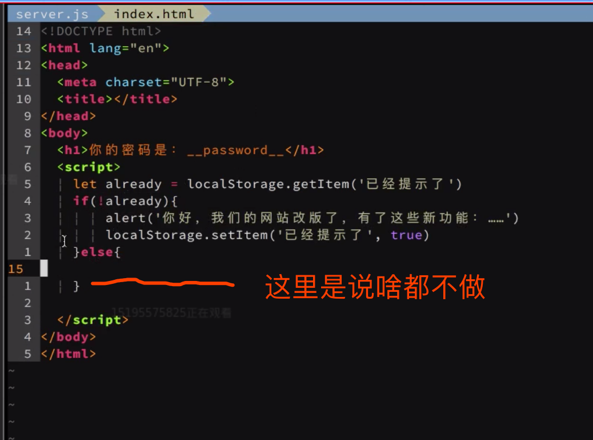

第一次读这个页面:
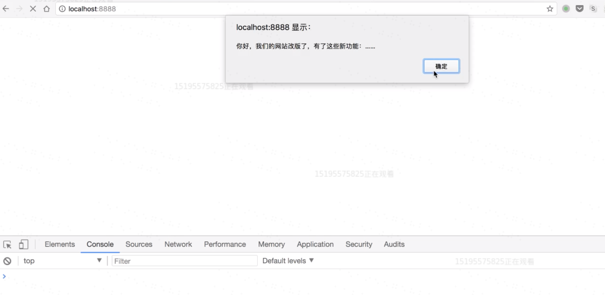

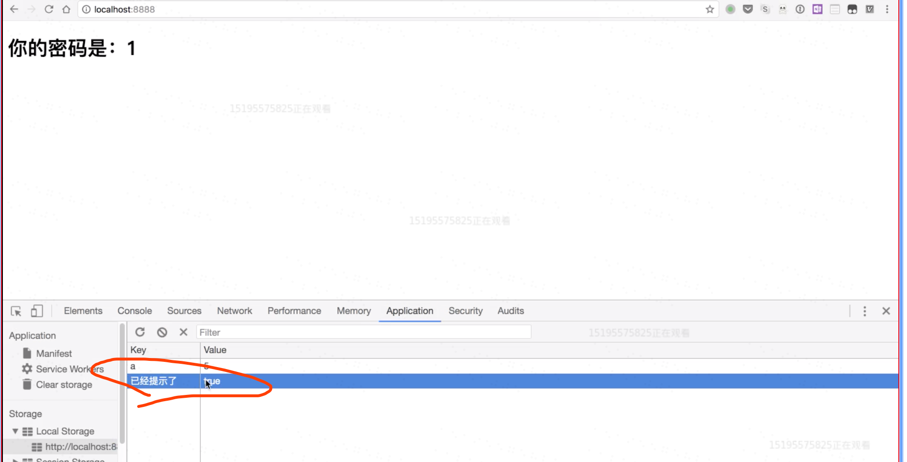

第二次刷新就不会再提示了;
### localstorage总结
需要记忆的:
LocalStorage 跟 HTTP 无关
HTTP 不会带上 LocalStorage 的值
只有相同域名的页面才能互相读取 LocalStorage（没有同源那么严格）
每个域名 localStorage 最大存储量为 5Mb 左右（每个浏览器不一样）
常用场景：记录有没有提示过用户（没有用的信息，不能记录密码）
LocalStorage 永久有效，除非用户清理缓存        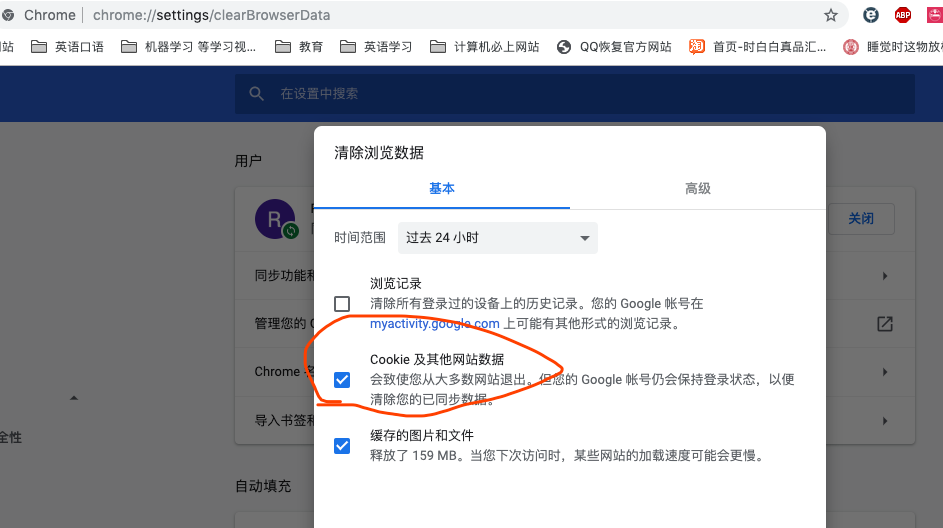

##  SessionStorage（会话存储）
1、2、3、4 同上
SessionStorage 在用户关闭页面（会话结束）后就失效。
Session 可以用 LocalStorage + 查询参数实现
## 总结这几者之间的关系
session是依赖于cookie的;cookie是session的基石;
cookie和localStorage的区别:
每次请求的时候cookie都会被带给服务器;而localstorage不会;
cookies一般4k,localstorage一般5M左右;
sessionstorage和localstorage区别:
 SessionStorage 在用户关闭页面（会话结束）后就失效;localstorage不会;
Cookie 默认在用户关闭页面后就失效，后台代码可以任意设置 Cookie 的过期时间 

## Cache-Control
web性能优化:

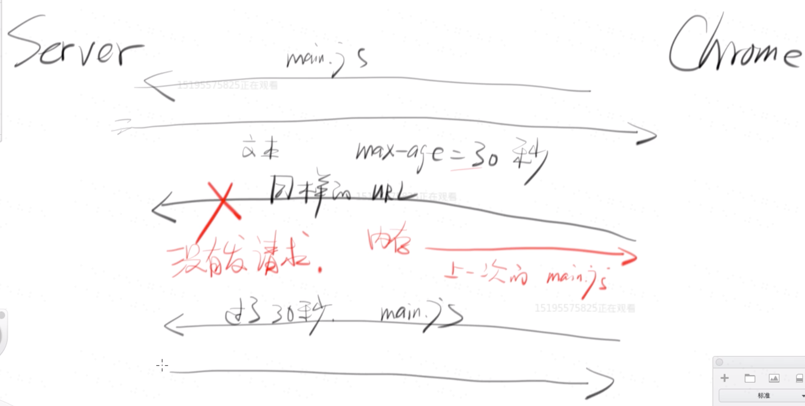

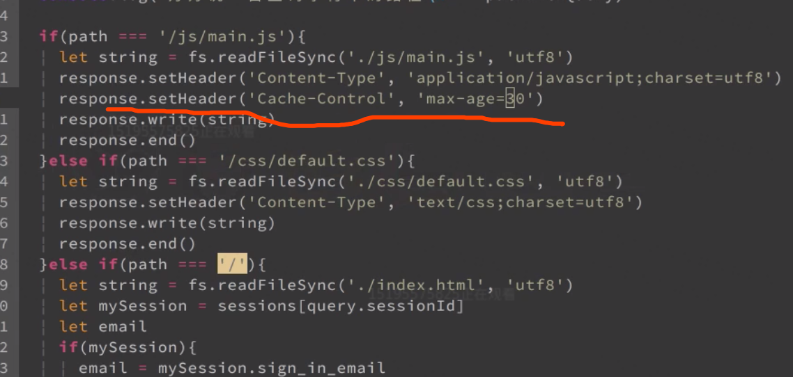
大概逻辑就是,chrome向服务器发了一次请求之后,如果在30ms之内想再次请求的话,直接可以从内存里面吧副本发送给客户端,不用去服务端了;
主要第一次是从服务器那边取得数据,后面可以不用从服务器，直接从内存里面;
你想哪个请求被缓存，就给个Cache-Control,max-age=xx
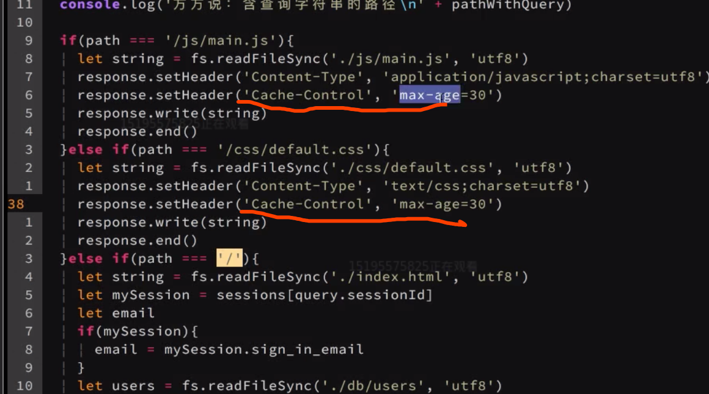
但是上面这种机制有个缺点,就是在max-age这段时间之内，无法获取最新的版本;
尽量把一个版本缓存,有多长时间就缓存多长时间;如果升级了,就改一下入口处的url(一般是html);
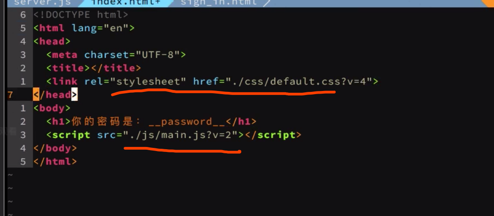
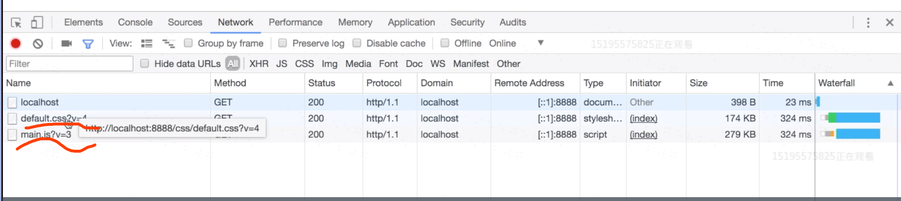
可以看看知乎的:
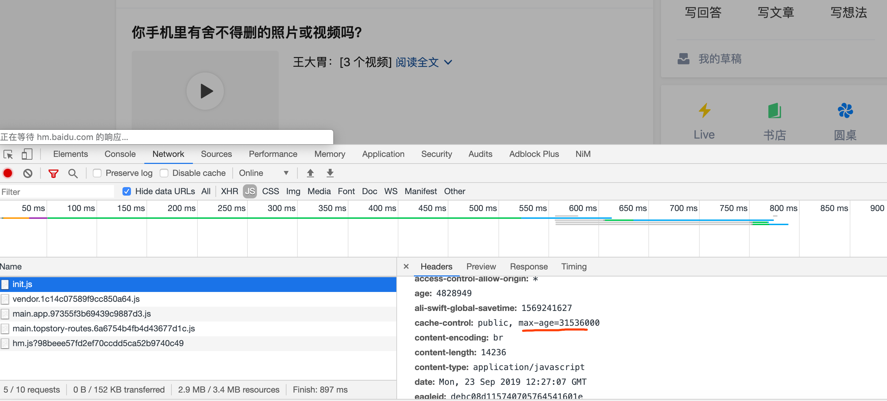

饿了么:
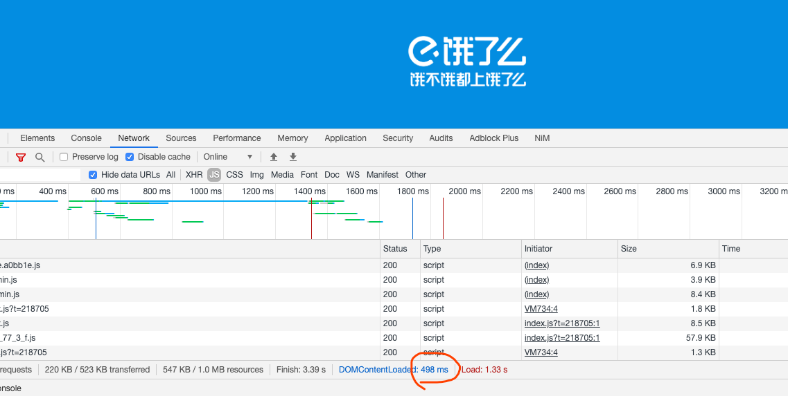
## expire:
expire是什么时间过期;
而max-age是还有多久过期;
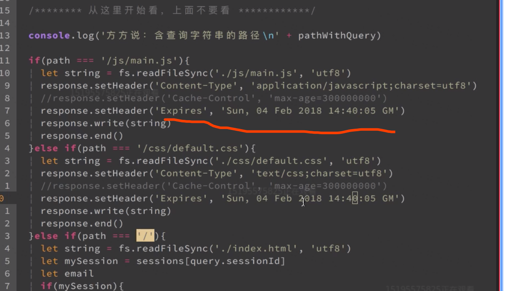

